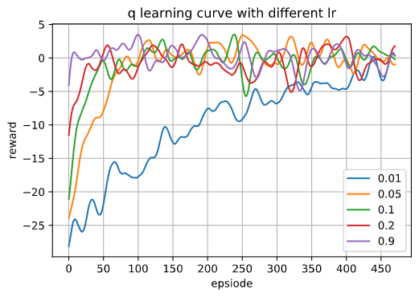
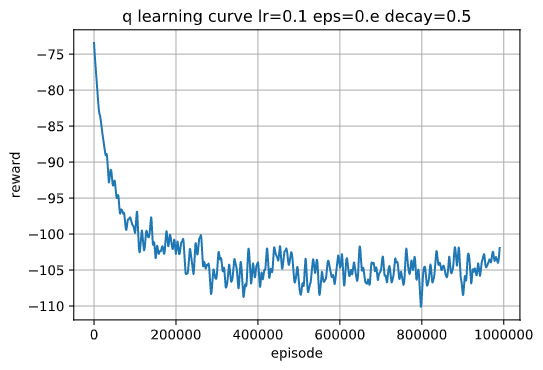
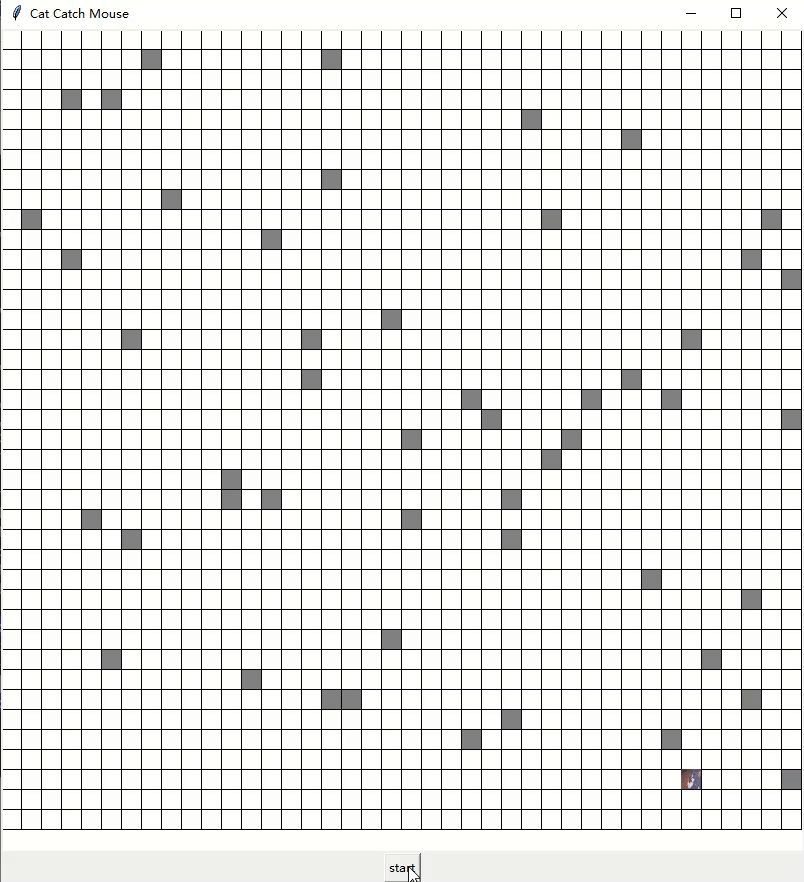

# 强化学习——猫捉老鼠

## 林仲航	2020210863

## 1. 问题描述与建模

不妨假设环境为$N\times M$的二维网格，其中猫位于网格左上角，即$(0,0)$处，老鼠位于网格右下角，即$(N-1, M-1)$处，将位置$(x,y)$统一编码为$p=N \times x + y$，故而该问题下的状态可以写为二维向量$s=(p_{cat},p_{mouse})$。此外还有一系列障碍物$[p_i,...]$。针对该问题，猫得到的最佳结果为抓到老鼠，即$p_{cat}=p_{mouse}$。可以定义如下的奖励函数：
$$
reward(p_{cat},p_{mouse})=\begin{cases}
10, & p_{cat}=p_{mouse}\\
-10, & p_{cat}=p_i\\
-1 & others
\end{cases}
$$
此外，猫可以采用动作只有上下左右四种，故而可以定义状态-动作值函数$Q(s,a)_{MN\times MN \times4}$，代表在状态$s$下采用动作$a$的未来总收益。当有了最优的$Q$函数后，即可通过贪心策略实现猫寻路的最优解。

## 2. 算法描述

采用Q-Learning算法来对$Q$函数求最优。实验首先将$Q$初始化为0值，随后进行多次循环，每次循环以猫抓到老鼠或者达到障碍物为停止条件。在单次循环中，猫的决策方法为$\epsilon$-greedy方法，具体为：以$1-\epsilon$的概率选取$action=argmax_a Q(s,a)$，以$\epsilon$的概率随机选取其它值$action=random({a|a \neq argmax_a Q(s, a)})$。随后猫采取行动$action$，观察下一个状态$s'$与得到的reward，利用以下公式进行更新：
$$
Q(s,a)\leftarrow Q(s,a)+\alpha[R+\gamma max_aQ(s',a)-Q(s,a)]
$$
多次循环后$Q$趋于收敛。

## 3. 实验细节

### 3.1 简单情况

网格大小为$(4,4)$，老鼠位于$(3,3)$的位置，猫位于$(0,0)$的位置，且老鼠保持静止不动。障碍物坐标为$[(1,2),(2,1)]$。此时其实可以将状态简化为$s=p_{cat}$，但是为了编程上的可复用性，依旧用$s=(p_{cat},p_{mouse})$来进行描述。可以输入命令：

```
python example.py --mouse_pattern stay
```

来运行Q-Learning算法并对结果进行可视化：


如图，可以看出算法在约100轮的时候基本收敛，可视化结果如下：

<div align=center>

</div>


可以看出猫可以找出最优路径，证明了强化学习在该问题上的有效性。

### 3.2 老鼠加入移动策略

假设老鼠按照随机策略运动，即老鼠会随机从上下左右四个方向中选取一个移动方向，若移动超过网格范围或者会移动到障碍物上，则保持不动。由于随机性，有时会出现老鼠向猫的位置移动的情况，为了简便，统一认为只有老鼠与猫的位置重合的情况下，才认为猫抓到老鼠。

除此之外，由于随机的移动策略过于简单，不妨给老鼠设定更为实际的运动策略，即在每一轮迭代中，老鼠会以0.5的概率尽可能远离猫的位置，以0.5的概率保持不动。以下给出两种策略的运行命令以及效果：

```
python example.py --mouse_pattern random
python example.py --mouse_pattern away --max_iter 2000
```


<div>
<center class="2 gif">
    
    
</center>
</div>


可以看出学习策略的有效性。example.py脚本的其它参数如下：

```
usage: example.py [-h] [--lr LR] [--eps EPS] [--eta ETA] [--max_iter MAX_ITER]
                  [--mouse_pattern {stay,random,away}] [--ms MS]

optional arguments:
  -h, --help            show this help message and exit
  --lr LR
  --eps EPS             eps-greedy
  --eta ETA
  --max_iter MAX_ITER
  --mouse_pattern {stay,random,away}
  --ms MS               animation interval
```

其中学习率默认为0.05，eps默认为0.2，max_iter默认为500，eta为衰减因子，默认为0.5。

### 3.3 Q learning参数对收敛性的影响

对于3.2中的问题，由于其训练时间较短，且状态也不算少，所以可以用于研究各个参数对Q learning算法的影响。



可以看出，学习率越高，在该问题下收敛越快，为了更好地对学习曲线进行可视化，采用hanning窗对学习曲线进行平滑。在该问题下，学习率设置过高似乎并不会对收敛有明显影响，只能说是问题过于简单导致的。此外，不同衰减因子对应的学习曲线图如下：


可以看出衰减因子越小，收敛速度越慢，但是对收敛的影响并没有学习率那么显著。


### 3.3 问题扩展

将网格扩大到$(40,40)$，随机布置50个障碍物，则该问题下状态数非常之多，利用先前的算法进行实验，发现即使将迭代次数设为500000次，依旧很难收敛，并且训练得到的agent表现非常的差，经常在某个区域不停往返。原因我估计有以下几点：

- 状态数过多，有2560000个状态，考虑四个action，Q table共有12800000个值需要更新
- 网格过多，agent多次迭代都很难达到成功的状态，反倒是更经常接触障碍物，导致其实际行动更接近于避开障碍物
- 奖励函数过于简单，不大适合问题复杂度很大的情况

为了解决以上问题，采用修改奖励函数的方法来人为地引入一些先验知识，从而辅助agent更快收敛，具体奖励函数为：
$$
reward(p_{cat},p_{mouse})=\begin{cases}
11-d(p_{cat}, p_{mouse})-0.1t, &p_{cat}\neq p_{block}\\
-1000, & p_{cat} =p_{block}
\end{cases}
$$
即将奖励函数改为与猫和老鼠之间的距离相关，其中距离采用曼哈顿距离。并且增加了惩罚项$-0.1t$，以激励agent更快找到目标。同时，增加迭代次数到1000000次，保证有足够多的尝试机会。


下图为同样条件，但是采用原始奖励函数的学习曲线：



发现该学习曲线完全不对，且运行结果也相当鬼畜。

总的来说，该修正奖励函数下，agent收敛相较快，且效果较好，效果图如下：



上述效果可以通过输入

```
python .\train.py --board_size 40 40 --blocks 50 --max_iter 1000000 --mouse_pattern random --reward dist --dst c_dist.pkl --lr 0.1 --eps 0.3 --eta 0.5
python visualize.py c_dist.pkl
```

即可运行。